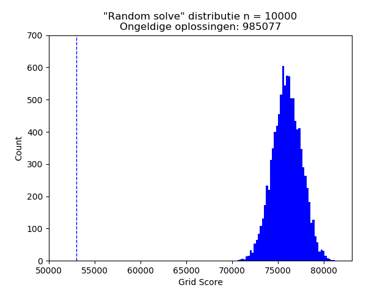
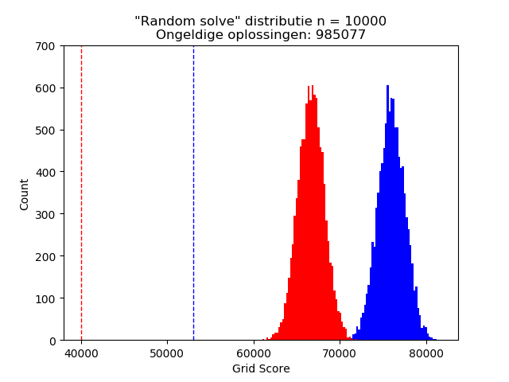

# Belangrijke resultaten

## Bounds en dichtheid oplossingen

In bovenstaand figuur is de scoredistributie van willekeurige, geldige oplossingen
getoond voor wijk 1 met de initiële plaatsing van de batterijen. Verder geeft
stippellijn de lower bound aan. Deze is berekend door alle Manhattan-afstanden
van de huizen tot hun dichtstbijzijnde batterij bij elkaar op te tellen.

## Batterijen verplaatsen

Bovenstaand figuur toont de posities van de huizen en batterijen in wijk 1 (bovenste
rij figuren). Van de output van de huizen en de capaciteit van de batterijen is
met behulp van gaussische verdelingen (standaarddeviatie = 10) een heat map gemaakt
(middelste rij figuren). Dit geeft een goede indicatie van waar de batterijen beter
geplaatst kunnen worden. Als de output van de huizen en de capaciteit over elkaar
heen legt (onderste rij figuren) wil je dat map zo wit mogelijk is (d.w.z. output
en capaciteit in balans). Na hill climben op deze heat map score komt er een betere
positionering van de batterijen uit...

In bovenstaand figuur is te zien hoe de scoredistributie van de willekeurige
oplossingen én lower bound is verschoven. Dit duidt erop dat met deze nieuwe
positionering van de batterijen lagere kosten gerealiseerd kunnen worden.          
